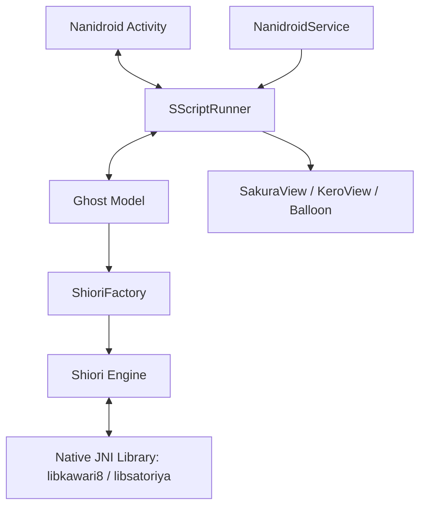

# Nanidroid Agent Architecture

This document provides a detailed overview of the agent architecture in Nanidroid, an Android port of the Ukagaka/Nanika desktop mascot platform. In the Ukagaka ecosystem, desktop agents are called **Ghosts**. They act as interactive digital companions that talk, react, and respond to system events.

---

## Architectural Overview

A Nanidroid agent (Ghost) is split into three main parts:
1. **The Brain (SHIORI)**: An AI engine or script parser that receives event notifications from the host system and returns dialogue scripts and visual commands.
2. **The Body (SHELL)**: The visual representation of the mascot. This contains coordinates, images, custom transparency maps, and state definitions (surfaces) for the main character (Sakura/\\h) and the sidekick character (Kero/\\u).
3. **The Dialog Bubble (BALLOON)**: The speech/text dialog frame used to show dialogue on screen.

### High-Level Component Layout



---

## The Event Loop & Protocol

The system runs on a request-response protocol inspired by HTTP, called **SHIORI/3.0**. 

### 1. Event Dispatch
When a system event occurs (such as a timer tick, mouse click, battery state change, or email notification), the hosting UI or background service triggers an event. For example, [Ghost.java](file:///C:/work/Nanidroid/src/com/cattailsw/nanidroid/Ghost.java) sends:

```http
GET SHIORI/3.0
Sender: Nanidroid
ID: OnSecondChange
SecurityLevel: local
Reference0: 12
Reference1: 0
Reference2: 0
Reference3: 1
```

### 2. Shiori Processing
The SHIORI engine processes the raw event request and returns a protocol response, e.g.:

```http
SHIORI/3.0 200 OK
Sender: EchoShiori
Value: \h\s[0]Hello! It is currently 12:00.\w8\u\s[10]Time flies!\e
Charset: UTF-8
```

### 3. Execution (Sakura Script)
The `Value` field contains code written in **Sakura Script** (a specialized markup DSL). The [SScriptRunner.java](file:///C:/work/Nanidroid/src/com/cattailsw/nanidroid/SScriptRunner.java) parses and runs this script, updating the characters' visual poses (surfaces) and showing speech balloon text:
- `\h`: Focus dialogue on Sakura (main character)
- `\u`: Focus dialogue on Kero (sidekick character)
- `\s[n]`: Change character's pose to surface `n`
- `\w[n]`: Wait `n` units of time
- `\e`: End of script

---

## Core Classes & Directories

Below is a breakdown of the Java components managing agents in Nanidroid:

### Agent Management
* [Ghost.java](file:///C:/work/Nanidroid/src/com/cattailsw/nanidroid/Ghost.java) — Represents an active mascot agent. It manages its description files, loads the shell images via `SurfaceReader` / `SurfaceManager`, and delegates events to the associated SHIORI engine.
* [GhostMgr.java](file:///C:/work/Nanidroid/src/com/cattailsw/nanidroid/GhostMgr.java) — Manages the catalog of installed mascot agents in the app's directory. Handles installing new agent packages (.nar) via `NarUtil`.
* [InfoOnlyGhost.java](file:///C:/work/Nanidroid/src/com/cattailsw/nanidroid/InfoOnlyGhost.java) — A lightweight class used to fetch basic details about an agent (like its name and folder path) without loading full visual and script assets into memory.

### Script Execution & UI Coordination
* [SScriptRunner.java](file:///C:/work/Nanidroid/src/com/cattailsw/nanidroid/SScriptRunner.java) — Interprets Sakura Script and coordinates UI changes, speech rendering, and interactive dialogs.
* [SakuraView.java](file:///C:/work/Nanidroid/src/com/cattailsw/nanidroid/SakuraView.java) & [KeroView.java](file:///C:/work/Nanidroid/src/com/cattailsw/nanidroid/KeroView.java) — Custom Android views that draw character sprites (with transparency support and touch/gesture detectors).
* [Balloon.java](file:///C:/work/Nanidroid/src/com/cattailsw/nanidroid/Balloon.java) — Draws speech balloons overlaying the characters on the screen.

### The Shiori (AI Engine) Subsystem
* [Shiori.java](file:///C:/work/Nanidroid/src/com/cattailsw/nanidroid/shiori/Shiori.java) — Common interface representing a Shiori engine.
* [ShioriFactory.java](file:///C:/work/Nanidroid/src/com/cattailsw/nanidroid/ShioriFactory.java) — Scans the ghost directory, matches descript configurations, and instantiates the correct Shiori implementation.
* [JNIShiori.java](file:///C:/work/Nanidroid/src/com/cattailsw/nanidroid/shiori/JNIShiori.java) — Abstract base class for shiori engines compiled as C++ libraries, managing JNI state and character encoding.
* [Kawari.java](file:///C:/work/Nanidroid/src/com/cattailsw/nanidroid/shiori/Kawari.java) — Concrete implementation of the Kawari8 AI engine, loading `libkawari8.so`.
* [SatoriPosixShiori.java](file:///C:/work/Nanidroid/src/com/cattailsw/nanidroid/shiori/SatoriPosixShiori.java) — Concrete implementation of the Satori AI engine, loading `libsatoriya.so`.
* [NanidroidShiori.java](file:///C:/work/Nanidroid/src/com/cattailsw/nanidroid/shiori/NanidroidShiori.java) — A lightweight, pure-Java Shiori engine. It reads simple event-dialog pairs from a locale-specific `content.txt` (located in a `ja` or `en` subfolder), serving as a simple fallback or mock shiori.

---

## Native Compilation and Bridges

To run standard C++ Shioris (such as Kawari and Satori) on Android, Nanidroid implements native JNI adapters:

### 1. Kawari Engine Bridge
* Native source: [kawari_jni.cpp](file:///C:/work/Nanidroid/jni/kawari8/kawari_jni.cpp)
* Android Makefile: [Android.mk](file:///C:/work/Nanidroid/jni/kawari8/Android.mk)
* Bridges JNI commands from Java's `Kawari` wrapper to call internal Kawari8 script functions.

### 2. Satori Engine Bridge
* Native source: [satori_jni.cpp](file:///C:/work/Nanidroid/jni/satori/satori_jni.cpp)
* Android Makefile: [Android.mk](file:///C:/work/Nanidroid/jni/satori/Android.mk)
* Provides POSIX compatibility layers mapping standard Satori calls into the JNI library `libsatoriya.so`.

### 3. POSIX/Win32 Compatibility Layer
* Location: [jni/_](file:///C:/work/Nanidroid/jni/_)
* Since standard desktop Shiori dlls frequently rely on Win32-specific APIs (such as Win32 Threading, Windows, Fonts, and Dialogs), Nanidroid embeds a translation shim in `jni/_` to stub out or map these definitions to Android-compatible POSIX calls.
