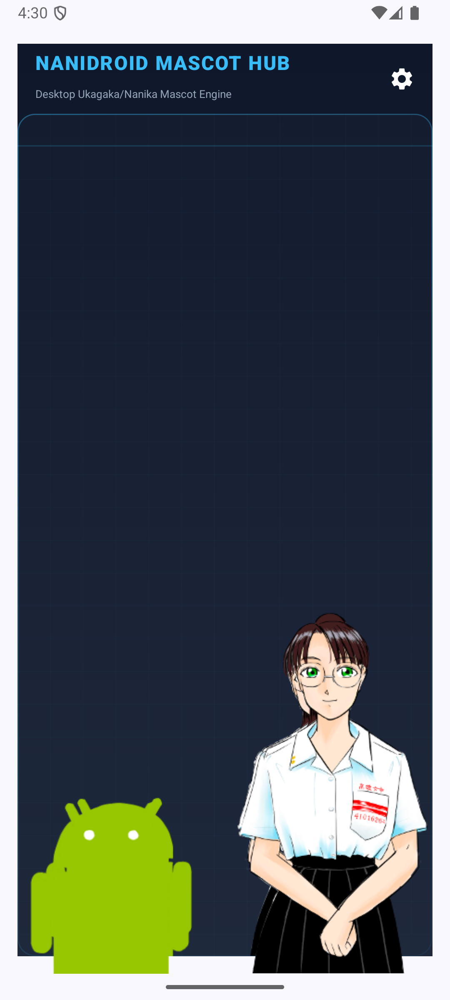
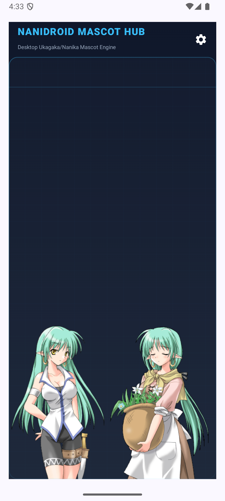
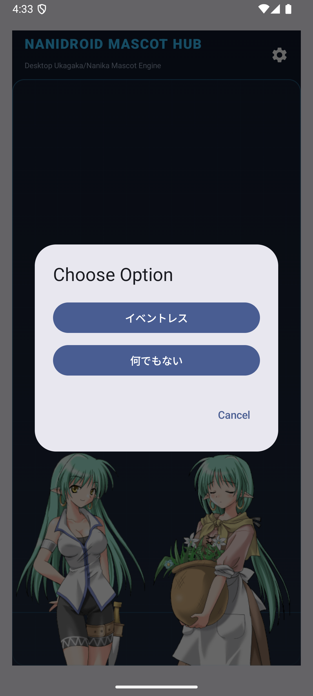

# Walkthrough: Nanidroid Modernization & Validation

We have successfully modernized the legacy Nanidroid codebase, addressing critical memory leaks, layout nesting warnings, high-DPI scaling, mascot animation speeds, one-shot loop controls, action-finish reset timeouts, JNI native builds, and the settings layout layout. The application builds cleanly and passes all local unit tests and manual emulator verification.

---

## What We Accomplished

### 1. Memory Leak & Lifecycle Resolutions
- **View References**: Converted direct view properties in [LayoutManager.kt](../app/src/main/java/com/cattailsw/nanidroid/LayoutManager.kt) and [SScriptRunner.kt](../app/src/main/java/com/cattailsw/nanidroid/SScriptRunner.kt) to `WeakReference` delegates and added `clearViews()` calls inside `onDispose` block.
- **Context Storage**: Replaced the `Context` parameter in the [Ghost.kt](../app/src/main/java/com/cattailsw/nanidroid/Ghost.kt) constructor with `applicationContext`.
- **Coroutines & ViewModels**: Migrated activity coroutines to `lifecycleScope`. Extended [MainScreenViewModel.kt](../app/src/main/java/com/cattailsw/nanidroid/ui/main/MainScreenViewModel.kt) from `AndroidViewModel` to manage service connections safely across screen rotations without killing the mascot session state.
- **Idle Surface Reset Timeout**: Introduced an auto-reset mechanism in [SScriptRunner.kt](../app/src/main/java/com/cattailsw/nanidroid/SScriptRunner.kt) that resets both Sakura and Kero views back to their default idle poses (`0` and `10` respectively) 5 seconds after an action completes (`stop()`). Any new runner executions cancel this pending reset.

### 2. High-DPI Density Scaling & Touch Coordinates
- **Layout Manager**: Integrated screen density metrics in [LayoutManager.kt](../app/src/main/java/com/cattailsw/nanidroid/LayoutManager.kt) to scale mascot views dynamically relative to high-DPI (xhdpi/xxhdpi) screen resolutions.
- **Touch Input Mapping**: Refactored the `onTouchEvent` handler in [SakuraView.kt](../app/src/main/java/com/cattailsw/nanidroid/SakuraView.kt) to scale raw touch coordinates back to the original surface image coordinates for accurate collision detection.
- **Animation Loop & Speed Control**: Modern SSP/Ukagaka shell specifications define pattern frame durations in milliseconds (1ms units). We reverted the previous centisecond multiplication to use the raw millisecond value directly. We then addressed the root cause of the "too fast" blinking: Android's `AnimationDrawable` loops infinitely by default. We modified [ShellSurface.kt](../app/src/main/java/com/cattailsw/nanidroid/ShellSurface.kt) to configure `isOneShot = (interval != A_TYPE_LOOP)` for all parsed animations, so eye blinks (`sometimes`/`rarely` intervals) execute exactly once and return to the idle pose instead of looping infinitely.

### 3. Beautiful Compose Dashboard Redesign
- **Top App Bar**: Added a transparent [TopAppBar](../app/src/main/java/com/cattailsw/nanidroid/ui/main/MainScreen.kt) with a settings gear icon, allowing the main screen to remain focused on the mascots and speech balloons by default.
- **Modal Bottom Sheet**: Tapping the gear icon opens a sleek, glassmorphic settings panel containing `Mascot Controls` (Install NAR, Update, preferences), `Overlay Desktop Mode` toggle, and `Installed Mascots` selection list.
- **Layout Warning Fix**: Removed the nested scroll measurements conflict by refactoring `CatalogCard`'s `LazyColumn` to a standard layout `Column` with `.forEach`.

### 4. Native & Resource Cleanup
- **JNI Compilation**: Removed the permissive `-fpermissive` flags from CMake compilation files. Native engines compile cleanly.
- **Safe I/O**: Streamlined resource reading in [DescReader.kt](../app/src/main/java/com/cattailsw/nanidroid/DescReader.kt) by consuming bytes first (avoiding premature stream close) and implemented Kotlin `.use` blocks on all file/resource streams.

---

## Verification & Testing

### 1. Automated Tests
All 30 unit tests pass successfully. 
We resolved the flaky animation test failure (`expected:<2> but was:<1>`) by ensuring:
1. `stopClock()` is explicitly called on `setUp` and `tearDown` inside [SSParserTest.kt](../app/src/test/java/com/cattailsw/nanidroid/test/SSParserTest.kt).
2. The global `talkAnimeControl` variable is reset to `0` inside the `reset()` initialization method of `SScriptRunner`.

### 2. Manual Emulator Verification
Using a `medium_phone` emulator (Android target API 36), we verified:
- **Overlay Permissions**: Successfully allowed drawing on top of other apps.
- **Mascot Rendering**: Sakura and Kero render at perfect density-scaled bounds at the bottom of the screen.
- **Interactive Touch & Dialogs**: Tapping the mascot triggers interactive dialogue and displays choices in a premium Jetpack Compose dialog box.

```carousel

<!-- slide -->

<!-- slide -->

```
