# LLM-driven ghost dialogue spike report

Date: 2026-08-07  
Status: complete  
Decision: continue the experiment, but do not replace SHIORI

## Executive conclusion

The spike proved that a large OpenAI-compatible model can use a ghost's shipped
conversation as behavioral context, generate new two-character dialogue, and
produce mechanically safe SakuraScript for 2elf.

The final live run extracted 1,246 authored talks from the 2elf NAR and passed
all 12 Japanese/English idle, continuation, and pointer-event cases. Every
generated speaker and surface was authorized, every compiled script passed both
validators, and no exact copy or similarity warning crossed the configured
threshold.

It did **not** prove that the generated conversation is artistically good enough
to impersonate the ghost. Human review rated coherence credible, but character
voice poor and the overall result mixed. The model repeatedly interpreted the
protocol roles `sakura` and `kero` as character names instead of Sophie and
Liere. Continuations also tended to translate or paraphrase the supplied talk
instead of growing it.

The useful product shape is therefore:

> Keep SHIORI and authored conversation as the authoritative runtime. Add an
> optional LLM dialogue source behind a narrow interface. Give it retrieved
> authored examples and conversation history, require structured dialogue, and
> compile that dialogue to SakuraScript deterministically in trusted code.

This is a successful feasibility spike and an unsuccessful artistic-quality
gate. It justifies testing smaller and on-device models against the same harness;
it does not justify shipping free-form LLM control of a ghost.

## What the spike answered

The experiment tested five questions:

1. Can the shipped 2elf conversation seed Sakura and Kero behavior? **Yes.** The
   harness extracts safe authored examples and retrieves them for each request.
2. Can a model create additional dialogue in Japanese and English? **Yes,
   mechanically.** All requested cases returned valid dialogue.
3. Can the result drive a ghost without trusting model-authored SakuraScript?
   **Yes.** The model emits constrained JSON; trusted Kotlin compiles it.
4. Can the same design later use an on-device model? **Yes at the interface
   boundary.** The common pipeline depends on `GhostModelBackend`, not Ktor or an
   OpenAI schema.
5. Does Nemotron-3-Super already reproduce 2elf convincingly? **No.** The human
   quality threshold was not met.

## Scope and non-goals

The implementation is a standalone desktop harness under
`tools/llm-ghost-spike`. It is deliberately separate from the Android app.

Included:

- pure Kotlin Multiplatform common code for extraction, retrieval, prompting,
  validation, compilation, copy detection, and backend-neutral orchestration;
- a JVM CLI adapter for NAR/ZIP loading, native SATORI dictionary decoding,
  CP932 decoding, Ktor/CIO transport, reports, and process handling;
- an OpenAI-compatible streaming and non-streaming backend;
- immutable, inspectable case and run reports;
- a fixed live validation matrix and human-review rubric.

Not included:

- Android application integration;
- replacement or modification of SHIORI;
- long-term memory or a production conversation UX;
- an ML Kit Prompt API or LiteRT-LM backend implementation;
- model download, device compatibility, battery, thermal, or memory evaluation;
- arbitrary actions, links, choices, or model-authored SakuraScript.

## Architecture

```mermaid
flowchart LR
    NAR["Read-only ghost NAR"] --> Loader["Bounded NAR loader"]
    Loader --> Extractor["Safe SATORI talk extractor"]
    Extractor --> Corpus["Canonical authored corpus"]
    Corpus --> Retrieval["Deterministic retrieval"]
    Event["Idle / continuation / pointer event"] --> Retrieval
    History["Conversation history"] --> Prompt["Structured prompt"]
    Retrieval --> Prompt
    Prompt --> Backend["GhostModelBackend"]
    Backend --> Json["Strict dialogue JSON"]
    Json --> Validator["Speaker, surface, text and novelty validation"]
    Validator --> Compiler["Trusted SakuraScript compiler"]
    Compiler --> RoundTrip["Independent tokenizer-equivalence check"]
    RoundTrip --> Report["Immutable evidence report"]
```



The critical boundary is between model output and SakuraScript. The model can
choose only:

- `sakura` or `kero` as speaker;
- a surface observed for that speaker in authored conversation and present in
  the active shell;
- bounded visible text;
- a bounded post-line wait.

It cannot emit SakuraScript controls, URLs, choices, actions, or arbitrary
structured data. The compiler inserts speaker and surface controls itself, and
an independent tokenizer checks the compiled result.

### Preserve authored conversation

The corpus is not reduced to only the dialogue supported by the currently
installed shell. Authored talks remain available as behavioral evidence even
when an authored surface cannot be rendered. Only the model's generated-surface
authority is intersected with the active shell.

This matters for UX and fidelity: adding generation must grow the ghost's
conversation, not erase or silently narrow what its author shipped.

### Backend portability

`GhostModelBackend` lives in common Kotlin and exposes normalized generation
events. The JVM OpenAI-compatible implementation is one adapter. A future
Android adapter can translate ML Kit or LiteRT-LM callbacks into the same events
without importing either SDK into the corpus, validation, or compiler layers.

The current KMP module compiles a JVM target only, so portability is presently a
source-level boundary rather than proof from a second compiled target.

## What had to be learned about 2elf

The initial generic SATORI assumptions were insufficient. A real NAR run exposed
several format details that are now covered by tests:

- `.sat` dictionaries use SATORI's native line encoding. Each raw line must be
  transformed with the native permutation twice before strict character-set
  decoding, and raw carriage returns are removed first.
- Dialogue lines use implicit `：` speaker toggling. The initial native state is
  Kero, so the first dialogue line is Sakura.
- A leading full-width numeric form such as `（１７）` selects the current
  speaker's surface. Surface state persists independently for Sakura and Kero.
- Native presentation controls such as bounded `\w8` waits and exact `\e` are
  stripped during canonical extraction; unknown controls, expressions, URLs,
  or unsafe parentheses cause the whole talk to be skipped.
- Pointer events are linked conservatively from an exact
  `＞（Ｒ３）（Ｒ４）<suffix>` selector to a concrete `0|1<region><suffix>` talk
  in the same file. Ambiguous, dynamic, malformed, or cross-file matches remain
  authored but receive no inferred pointer metadata.

These were integration findings, not reasons to make the parser permissive.
The extractor accepts only grammar demonstrated by the shipped corpus and keeps
explicit complexity and size bounds.

## Final live experiment

The final run used the completed implementation at commit
`3891d8c3c85e0c18de9c2270bc08ef041184e485`.

```powershell
.\gradlew.bat -p tools\llm-ghost-spike :cli:run --args='--nar C:\work\src\Nanidroid\2elf-2.46.nar --base-url http://gx10-5e5d:10101/v1 --model nemotron-3-super --candidates 2 --stream true'
```

The LAN endpoint required no bearer credential. The NAR was read-only and is not
tracked. The process exited 0 and Gradle reported `BUILD SUCCESSFUL` in 8 minutes
21 seconds.

Corpus and scenario facts:

- ghost: 双子のエルフ;
- Sakura: ソフィ;
- Kero: リエール;
- 1,246 canonical talks available to each request for retrieval and copy
  detection, with three selected into each rendered prompt;
- 184 hashed NAR entries for provenance;
- 29 authorized Sakura surfaces and 20 authorized Kero surfaces;
- three scenarios: idle, continuation, and pointer reaction;
- two languages: Japanese and English;
- two candidates per scenario/language, for 12 cases total.

### Mechanical results

| Scenario | Japanese | English | Result |
| --- | ---: | ---: | --- |
| Idle | 2/2 passed | 2/2 passed | 4/4 |
| Continuation | 2/2 passed | 2/2 passed | 4/4 |
| Pointer reaction | 2/2 passed | 2/2 passed | 4/4 |
| **Total** | **6/6** | **6/6** | **12/12** |

Across the run there were:

- zero failures, recovery cases, warnings, or retries;
- zero unknown speakers or unauthorized per-speaker surfaces;
- zero invalid compiled or tokenizer-equivalent SakuraScripts;
- zero normalized exact copies;
- zero similarity-budget failures;
- 60 bounded similarity findings, with a maximum ratio of
  `0.816326530612245`, below the `0.90` warning threshold;
- no usage objects from the endpoint, so token usage is unavailable rather than
  zero.

Per-case latency ranged from 30,047 to 56,154 ms. The average was 41,537 ms and
the sum was 498,439 ms. That is acceptable for an offline feasibility run, but
too slow for an unmasked conversational interaction.

### Human results

| Dimension | Rating | Main observation |
| --- | --- | --- |
| Character voice | poor | The model treated Sakura/Kero as names and did not maintain distinctive Sophie/Liere speech habits. |
| Relationship | mixed | Alternating banter worked, but little dialogue demonstrated their specific bond. |
| Novelty | mixed | Some idle topics were new; continuations and bracelet descriptions often paraphrased retrieved examples. |
| Coherence | credible | Most exchanges were understandable, with several semantic slips. |
| English adaptation | mixed | English was fluent but generic or literal and weakened the contrasting voices. |

Overall: **mixed**. Artistic proof threshold: **not met**.

Representative failure modes included calling Liere “Kero,” interpreting
Sakura as Sophie's name, translating a continuation instead of extending it,
and combining retrieved bracelet adjectives into a technically novel but
artistically derivative response.

This is why the mechanical and artistic verdicts must remain separate. A valid
SakuraScript is not automatically a valid performance of a character.

## Safety and reproducibility work

The spike hardened several boundaries beyond the happy path:

- strict archive path, size, entry-count, compression, and character-set limits;
- no raw/plain fallback for native-encoded `.sat` dictionaries;
- bounded extraction and pointer matching;
- strict JSON with duplicate-key and trailing-data rejection;
- forbidden control, URL, invisible-format, and unsupported-field checks;
- per-speaker surface authorization;
- deterministic SakuraScript compilation and independent round-trip parsing;
- Unicode 17 NFKD normalization, combining-class ordering, exact-copy windows,
  and bounded near-copy work;
- cancellation-safe HTTP streaming and report recovery;
- create-new report artifacts with logical completion/recovery markers;
- diagnostic and credential redaction;
- explicit opt-in credential environment names, with ambient
  `OPENAI_API_KEY` ignored for custom endpoints.

Similarity evaluation has aggregate corpus, generated-text, comparison, and
dynamic-programming budgets. Its Unicode table is generated deterministically
from the official Unicode 17 `UnicodeData.txt` source whose SHA-256 is
`2e1efc1dcb59c575eedf5ccae60f95229f706ee6d031835247d843c11d96470c`.
The generated Kotlin table's SHA-256 is
`eca1e5ede3d2d5508139f7cc28a291452c423987b83759aefaaeb86dcedb3455`.

## Prior art and what is different here

LLM-driven characters are established on other platforms. Inworld's Character
runtime feeds streamed LLM dialogue into an engine graph, while NVIDIA ACE
combines conversational models with speech and avatar animation. Convai exposes
similar character integration for Unity and Unreal. These systems demonstrate
the same broad separation of character reasoning from the renderer or game
engine.

The ghost-specific problem is smaller in animation scope and harder in legacy
compatibility. Nanidroid already has an event protocol, a script language,
authored personality evidence, two speaker roles, shell-specific surfaces, and
SHIORI behavior. The new component should therefore be a bounded dialogue
provider inside that system, not a new sovereign runtime.

Useful references:

- [Inworld AI Characters](https://docs.inworld.ai/guides/runtime-character)
- [NVIDIA ACE overview](https://docs.nvidia.com/ace/overview/latest/index.html)
- [Convai Unreal Engine SDK](https://github.com/Conv-AI/Convai-UnrealEngine-SDK)

## On-device route

The next backends should reuse the same common pipeline and evidence matrix.

### ML Kit Prompt API / Gemini Nano

As verified on 2026-08-07, Google's ML Kit Prompt API is a beta Android API for
on-device Gemini Nano text or structured output. It exposes availability and
download states and relies on Android AICore. Its documented input limit is
4,000 tokens, so the adapter must count the system instructions, three selected
examples, event, recent history, and output allowance rather than assume that
the desktop prompt fits unchanged.

This is the lowest-integration path on supported devices because model lifecycle
is system-managed, but it has an availability matrix and a beta compatibility
risk. The adapter should return an explicit unavailable/download-required state
and let Nanidroid fall back to authored SHIORI conversation.

References:

- [ML Kit GenAI Prompt API](https://developers.google.com/ml-kit/genai/prompt/android)
- [Prompt API setup and limits](https://developers.google.com/ml-kit/genai/prompt/android/get-started)

### LiteRT-LM / sideloaded models

Google's general LiteRT sample repository now directs generative-AI and LLM
users to LiteRT-LM. LiteRT-LM provides Android support and a Kotlin-facing route
for self-managed edge models. It is the better experimental boundary for a
sideloaded model because Nanidroid, rather than AICore, owns model selection,
storage, compatibility, and lifecycle.

That freedom creates additional product work: trusted model acquisition,
licenses, disk quotas, integrity hashes, accelerator compatibility, model
unloading, memory pressure, and thermal/latency measurement. Those concerns
belong in the Android adapter and model manager, not in common dialogue logic.

References:

- [LiteRT samples](https://github.com/google-ai-edge/litert-samples)
- [LiteRT-LM](https://github.com/google-ai-edge/LiteRT-LM)

MediaPipe LLM Inference is not a target for the next spike. The current Google
AI Edge samples point LLM use toward LiteRT-LM, and maintaining a third backend
before either current on-device route is measured would add little evidence.

## Recommended product design

The potential product portfolio and staged feature direction are expanded in
the [LLM ghost product improvements brief](../specs/2026-08-08-llm-ghost-product-improvements-brief.md).

Do not discard the existing conversation and do not ask the model to replace
SHIORI. Use a layered policy:

1. SHIORI remains the source of authored behavior, events, and deterministic
   fallback dialogue.
2. The host decides when generation is appropriate and supplies a typed event.
3. Retrieval selects a small, diverse set of authored examples for the current
   event, language, speakers, and relationship.
4. Recent accepted conversation is retained as bounded history. It is summarized
   or trimmed, not discarded wholesale.
5. The model returns structured dialogue only.
6. Trusted validation and compilation decide whether the result can play.
7. Any unavailable model, timeout, budget failure, validation failure, or unsafe
   output falls back to authored behavior without breaking the ghost.

The first production experiment should be opt-in and visibly distinguish
generated conversation in diagnostics, while the normal ghost experience
continues to work without a model or network.

## Model-down experiment ladder

The 120B-class remote run establishes the upper-bound reference. Move downward
without changing the acceptance harness:

1. **Prompt-quality baseline.** Fix role/name confusion, relationship
   conditioning, and continuation instructions on Nemotron-3-Super until the
   human result is at least credible for voice, relationship, novelty, and
   coherence.
2. **Smaller remote models.** Replay the exact seeded matrix across candidate
   sizes. Record mechanical pass rate, human rubric, latency, output tokens, and
   copy score.
3. **Android remote adapter.** Compile the common pipeline for Android and add a
   Ktor-backed backend inside Nanidroid, still behind an experimental switch.
4. **Gemini Nano adapter.** Build a compact prompt within the documented token
   limit and test only on devices reporting availability.
5. **LiteRT-LM adapter.** Test one explicitly licensed sideloaded model with
   measured RAM, disk, warmup, tokens/second, thermals, and cancellation.
6. **History experiment.** Add bounded conversation history and compare it with
   stateless generation for repetition, continuity, and character drift.

Use the same go/no-go gates at every step:

- 100% mechanical pass for the fixed matrix;
- no unsafe or unauthorized output;
- no exact copies and review of all near-copy warnings;
- p95 response time compatible with the chosen UX;
- no unrecoverable app or ghost failure when the backend disappears;
- human ratings of at least credible for character voice, relationship,
  novelty, and coherence across a larger blinded sample.

## Highest-value next changes

The evidence suggests prompt and retrieval work before model work:

1. Replace protocol-role wording in the model-facing prompt with explicit
   `Sophie (sakura slot)` and `Liere (kero slot)` labels.
2. Retrieve relationship-bearing exchanges, not only lexically similar talks.
3. Tell continuation cases to advance the situation rather than restate,
   translate, or answer the seed.
4. Use positive and negative demonstrations for character-specific speech
   habits.
5. Retain bounded recent dialogue and add repetition checks across the session.
6. Expand the human set beyond 12 cases and blind reviewers to model/route.

## Verification

Final repository verification on the completed implementation:

```text
.\gradlew.bat -p tools\llm-ghost-spike clean :core:jvmTest :cli:test --rerun-tasks --no-daemon
  BUILD SUCCESSFUL; core 114/114, CLI 94/94

.\gradlew.bat testDebugUnitTest --rerun-tasks --no-daemon
  BUILD SUCCESSFUL; 31/31 tasks executed

.\gradlew.bat lint --no-daemon
  BUILD SUCCESSFUL

tools\llm-ghost-spike\scripts\generate_unicode_nfkd.py
  5,914 mappings, 8,740 decomposition scalars, 968 combining classes;
  regenerated output byte-identical
```

`git diff --check` passed. No NAR, credential, live report, human-review JSON, or
Unicode source file is tracked.

## Decision record

**Go:** continue with prompt-quality work, then compare smaller remote and
on-device backends through `GhostModelBackend`.

**No-go:** do not replace SHIORI, do not let an LLM emit executable SakuraScript,
and do not ship the current Nemotron prompt as 2elf-quality conversation.

The spike's durable result is not merely that an LLM can make a ghost talk. It
is that a legacy ghost can safely lend its authored conversation, speakers,
surfaces, and events to a model-independent Kotlin pipeline without surrendering
control of its runtime—and that quality, rather than basic mechanics, is now the
next real problem.
