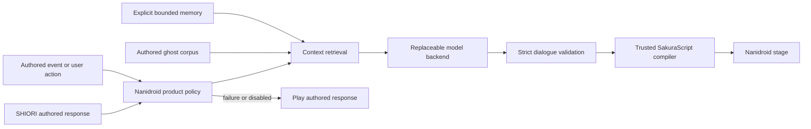

# LLM ghost product improvements brief

Date: 2026-08-08  
Status: proposed product direction  
Related evidence: [LLM-driven ghost dialogue spike report](../reports/2026-08-07-llm-ghost-dialogue-spike.md)

## Product thesis

Nanidroid can make ghosts feel alive without replacing what their authors
created. The opportunity is not an unrestricted chatbot wearing a ghost shell.
It is an additive relationship layer that:

- preserves authored SHIORI behavior and conversation;
- learns only what the user deliberately shares;
- produces context-aware conversation through a validated dialogue boundary;
- falls back invisibly when generation is unavailable or unsafe;
- helps authors expand ghosts without surrendering editorial control;
- eventually lets independently authored characters meet.

The intended user impression is:

> I opened a familiar ghost. It still behaved like itself, but it remembered me,
> reacted to what we had done together, and had something new to say.

## Product principles

All proposed features follow these principles.

1. **Authored behavior is primary.** Generated content supplements rather than
   deletes, rewrites, or silently narrows shipped dialogue.
2. **SHIORI remains authoritative.** It continues to own ghost events,
   deterministic behavior, and the reliable fallback response.
3. **The model does not write executable script.** It returns constrained
   dialogue; trusted Nanidroid code validates it and compiles SakuraScript.
4. **Memory is legible and controllable.** Users can see, correct, forget,
   export, or disable retained information.
5. **Relationship growth is reciprocal.** Repeated taps or passive uptime alone
   cannot manufacture intimacy.
6. **Generated authorship is visible in tools.** Diagnostics and author exports
   preserve provenance, model version, source examples, and validation results.
7. **No model is mandatory.** A ghost must remain usable when a remote endpoint,
   Gemini Nano, or a sideloaded model is unavailable.

## Product portfolio

| Improvement | User promise | Product horizon |
| --- | --- | --- |
| Living Relationship | The ghost gets to know me and remembers our shared history. | First |
| Contextual Touch | Touch responses reflect repetition, relationship, and recent conversation. | Next |
| Ghost Studio | Authors can generate, inspect, edit, and export candidate dialogue. | Parallel after the memory foundation |
| Guest Scenes | Characters from separate ghosts can meet without blending identities. | Later |

Free-form Character.ai-style conversation is a phase of Living Relationship,
not a separate memory system.

## Improvement 1: Living Relationship

### User promise

The ghost recognizes the user across sessions and can continue a relationship
without losing its authored character or requiring the user to start a separate
chat application.

### Experience

On first activation, Nanidroid plays the ghost's real `OnFirstBoot` response
unchanged. After that authored sequence completes, an optional generated
epilogue may introduce memory and ask one to three lightweight questions that
fit the character.

The epilogue must:

- explain that remembered information is optional;
- avoid repeating a question when Nanidroid observed a supported input flow,
  retained its answer with consent, and can identify its meaning safely;
- accept “skip” without character pressure or degraded functionality;
- store only explicit answers, not inferred sensitive traits;
- end quickly enough that it does not take over the author's introduction.

On later boots, Nanidroid retrieves at most a few relevant memories. The ghost
may acknowledge one naturally when the authored response has completed or when
the user deliberately enters conversation mode.

Example first proof:

1. The authored 2elf first-start sequence plays.
2. Sophie asks what the user prefers to be called and one character-relevant
   question.
3. The user closes 2elf.
4. On a later boot, Sophie makes a coherent callback and Liere reacts in a way
   grounded in their shipped relationship.

### Memory boundaries

Memory has three explicit layers:

- **User profile:** deliberately shared facts that may be available to all
  ghosts, initially limited to preferred name and similarly low-risk settings.
- **Per-ghost relationship memory:** facts learned by this ghost, prior topics,
  promises, unresolved questions, and a bounded relationship state.
- **Recent context:** a short rolling window or summary used for conversational
  continuity and repetition avoidance.

Per-ghost memory is private by default. One ghost cannot access another ghost's
relationship history merely because both are installed. Guest scenes require a
separate, explicit disclosure decision.

Each retained item needs:

- the remembered statement in user-readable form;
- whether it is global or belongs to one ghost;
- provenance from an explicit answer or accepted conversation;
- creation and last-used time;
- optional expiration;
- correction and deletion controls.

Raw transcripts are not permanent memory by default. A bounded transcript may
support the current session, while durable memory is a smaller set of explicit
facts and summaries.

### Conversation mode

After onboarding and recall are credible, Nanidroid may expose an intentional
“Talk” affordance. The user can type freely, while the ghost responds through
its existing balloons and stage.

Conversation mode reuses the same authored corpus, memory store, validators,
compiler, backend fallback, and reporting boundary. It additionally needs:

- visible generation and cancellation progress;
- interruption without corrupting history;
- retry and authored fallback behavior;
- a way to inspect and remove newly retained memories;
- bounded turn history and repetition detection.

Conversation mode is not part of the first implementation slice. The first
slice proves onboarding and later recall without introducing a full chat UI.

### First-slice acceptance criteria

- The authored `OnFirstBoot` script is byte-for-byte unchanged and plays first.
- The onboarding epilogue is opt-in and can be skipped.
- A preferred name and one per-ghost fact can be stored, displayed, corrected,
  and deleted.
- A later activation can retrieve and use one relevant fact.
- Disabling or deleting memory prevents future prompt use.
- Backend timeout, unavailability, rejection, or validation failure returns to
  authored behavior without breaking boot.
- The feature works with no model configured by remaining entirely dormant.
- Human review finds the callback coherent and in character in a fixed 2elf
  test matrix.

### Exclusions from the first slice

- automatic extraction of arbitrary internal SHIORI variables;
- inferred medical, emotional, demographic, or relationship facts;
- background listening or observation;
- cloud synchronization;
- guest access to private memories;
- a general-purpose chat screen.

## Improvement 2: Contextual Touch

### User promise

Touching a familiar collision does not feel like pulling a random line from a
small response pool. The reaction can recognize repetition, recent conversation,
and an earned relationship while remaining faithful to the authored ghost.

### Hybrid response policy

Nanidroid first requests and preserves the real SHIORI touch response. It may
consider generation only when an additive response is valuable, such as when:

- the authored response recently repeated;
- the collision has several demonstrated authored reactions;
- recent conversation provides safe, relevant context;
- the user deliberately enabled contextual generation.

The generation request contains only bounded, typed context:

- ghost and speaker identity;
- collision speaker and region;
- gesture/event type;
- recent repetition count;
- selected authored responses for that exact or closely related event;
- current relationship band;
- a small set of relevant memories or recent accepted turns;
- authorized surfaces for each speaker.

The model may write dialogue only. It cannot define hitboxes, reinterpret the
collision, invoke actions, alter relationship state, or emit script controls.

### Relationship policy

Touch familiarity is not a counter that grows without limit. Repeated touching
may change immediate wording, including annoyance or boundary-setting, but
cannot independently advance the relationship. Relationship progression needs
reciprocal conversation, distinct sessions, and accepted interactions.

### First-slice acceptance criteria

- One 2elf collision has at least three validated generated variations.
- The response distinguishes a first touch from rapid repetition.
- One variation can reference a safe recent conversational fact.
- Sophie and Liere retain correct names, roles, and authorized surfaces.
- Any failure plays the preserved authored SHIORI response.
- Repeated tapping cannot increase persistent relationship state.
- Users can disable contextual touch independently of other memory features.

## Improvement 3: Ghost Studio

### User promise

Ghost authors can use the model as a constrained writing assistant, inspect why
a candidate was produced, and decide what becomes part of their work.

### Workflow

An author supplies an editable ghost source or NAR and chooses a bounded task,
for example:

- add idle-talk candidates for a demonstrated topic;
- propose variations for a specific pointer collision;
- extend an existing conversation rather than paraphrasing it;
- draft an English adaptation while preserving contrasting voices;
- identify authored events with unusually little safe dialogue coverage.

For every candidate, Ghost Studio shows:

- event and scenario;
- Sakura/Kero turns and surfaces;
- rendered preview;
- selected authored examples and stable source identifiers;
- normalized exact/near-copy evidence;
- model, prompt, seed, and generation time;
- mechanical validation and rejection reasons;
- author status: unreviewed, edited, approved, or rejected.

The author can edit before approval. Editing reruns validation and similarity
checks without asking the model to reinterpret the change.

### Export levels

1. **Review bundle:** portable HTML plus machine-readable JSON and evidence.
2. **Native fragment:** an approved SATORI or other detected source-format block
   where the grammar can be emitted safely.
3. **Expansion pack:** a future separately installable and removable collection
   with attribution and compatibility metadata.

The first slice implements the review bundle and one SATORI fragment exporter.
It never rewrites the original NAR or source dictionary automatically.

### Privacy and authorship boundary

Runtime user memories, transcripts, names, and private facts are excluded from
author exports by default. An authoring prompt may use only the shipped corpus,
explicit author instructions, and deliberately supplied synthetic scenarios.

Generated text remains a candidate until a human marks it approved. Reports
must not imply that the original ghost author wrote or endorsed unapproved
content.

### First-slice acceptance criteria

- An author can batch-generate candidates for one idle category and one touch
  collision.
- Every candidate has sufficient provenance to reproduce or explain it.
- Exact copies are rejected and near copies are visible.
- Edited candidates are revalidated locally.
- Approved candidates export as review HTML/JSON and a source fragment.
- Rejecting a candidate leaves no change in the ghost source.
- No runtime memory or credential appears in exported artifacts.

## Improvement 4: Guest Scenes

### User promise

Characters from separately installed ghosts can meet while preserving their own
voices, appearances, knowledge, and relationships.

An illustrative target is 2elf's Sophie interacting with the original Nanika
Sakura. This is intentionally a later product improvement rather than a prompt
variant.

### Required product capabilities

- independently extracted and versioned persona corpora;
- an explicit cast and scene premise;
- a scene orchestrator that owns turn order but not character voice;
- per-character speaker, surface, shell, memory, and validation authority;
- rules for what memories each participant may know;
- multi-shell stage composition and collision routing;
- graceful degradation when one guest cannot load or generate;
- provenance that identifies which corpus grounded each turn.

Nanidroid currently presents the ordinary Sakura/Kero pair and ignores
presentation commands for additional scopes. Because 2elf already uses both
roles, an authentic Sophie–Liere–Sakura scene requires renderer and stage work.
It cannot be represented honestly as a two-speaker prompt.

### First-slice acceptance criteria

- Two characters from different ghosts appear simultaneously in a controlled
  scene without replacing either source installation.
- Each character's generated turns use only its own corpus and authorized
  surfaces.
- The scene planner cannot merge memories or identities.
- Reviewers attribute at least 15 of 20 blinded dialogue turns to the correct
  demonstrated character.
- Ending the scene restores the ordinary active ghost without state corruption.

Guest Scenes begins only after Living Relationship and Contextual Touch have
stable identity, memory, and fallback semantics.

## Shared product architecture

The completed spike supplies the common dialogue safety pipeline. Future
features add host policy around it rather than weaken it.

Shared components should include:

- typed ghost-event and interaction context;
- character identity distinct from Sakura/Kero protocol slots;
- bounded corpus retrieval;
- explicit memory retrieval and disclosure policy;
- model-independent generation events;
- strict dialogue validation and deterministic compilation;
- copy, repetition, and character-quality evaluation;
- authored fallback arbitration;
- inspectable diagnostics that do not leak credentials or private memory.

Backend choice is orthogonal to the product feature. Remote OpenAI-compatible,
Gemini Nano through ML Kit Prompt API, and sideloaded LiteRT-LM adapters should
all cross the same common boundary.

## Delivery sequence

### Phase 1: relationship proof

Build the Living Relationship first slice for 2elf: authored first boot,
optional onboarding epilogue, explicit memory controls, and one later callback.
This is the smallest experiment that tests the intended emotional value.

### Phase 2: embodied continuity

Use the same memory and relationship policy for one contextual touch collision.
Then add free-form conversation mode only after boot and touch callbacks are
credible.

### Phase 3: author tooling

Turn the existing immutable spike reports into a review UI and source-fragment
export. Ghost Studio can proceed without enabling runtime generation for end
users, but it reuses the same validators and quality evidence.

### Phase 4: cross-ghost scenes

Design and implement multi-shell stage composition, then evaluate a controlled
two-character guest scene before attempting larger casts.

## Portfolio success measures

Mechanical correctness remains a gate, not the product outcome.

Measure:

- percentage of generated cases that validate without retry;
- authored-fallback success under offline, timeout, cancellation, and invalid
  output conditions;
- response latency and abandonment;
- exact/near-copy and within-session repetition rates;
- memory correction, deletion, and feature-disable reliability;
- frequency of incorrect names, identities, or relationship claims;
- blinded human ratings for voice, relationship, novelty, and coherence;
- author approval/edit/rejection rates in Ghost Studio;
- how often remembered callbacks are rated welcome rather than surprising or
  intrusive.

No feature advances beyond an opt-in experiment while character voice remains
poor in the fixed evaluation set.

## Product decisions captured by this brief

- Generated dialogue is additive; authored dialogue is never discarded to make
  room for it.
- First-start onboarding follows the authored sequence rather than being
  inserted into or written back to ghost files.
- A small explicit profile may be global; relationship memories remain
  per-ghost by default.
- Touch generation preserves the authored response as fallback and cannot farm
  relationship progression.
- Conversation mode shares the Living Relationship memory model.
- Ghost Studio is human-reviewed and never exports private runtime memory by
  default.
- Guest Scenes require multi-shell product work and independent character
  grounding; they are not implemented as role substitution inside a two-speaker
  prompt.

## Immediate recommendation

The next design effort should cover only the Living Relationship first slice.
It should define the exact post-`OnFirstBoot` arbitration point, memory data and
privacy model, user controls, authored fallback behavior, and a 2elf evaluation
script. Contextual Touch, Ghost Studio, and Guest Scenes should remain separate
specification and implementation cycles that consume the shared foundation.
