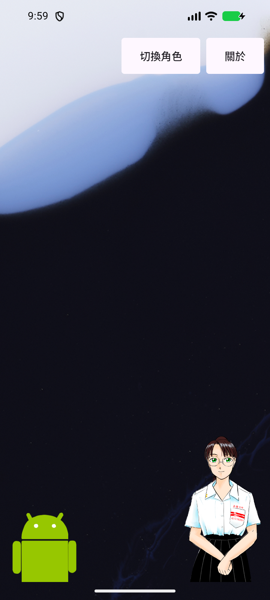

# Solid stage controls: screenshot evidence

Captured directly from an API 37 Android emulator on 2026-10-05. These are
emulator screenshots, not physical-device captures or mockups. No physical
device was connected. Images are unedited `adb shell screencap -p` output.

- App source: `8afe17b7` (solid text-only controls and toolbar translations).
- Variant: release, locally test-signed with the standard debug key solely for
  emulator installation. The production signing key was not used.
- Screenshot APK SHA-256:
  `8971cb691d57e183f1e02866740c5db4c7fea77a3ca12157faeb687829cbd787`.
- API 37, 720 x 1600 px, 320 dpi (360dp width), default font scale.
- Bundled ghost, stock emulator wallpaper. Release hides the debug Bounds button.
- Per-app locales were set to en-US, ja-JP and zh-TW, with a cold launch before
  capture. All three screenshots were visually inspected.
- The AVD ran read-only without saving a snapshot, then was closed.

| English | Japanese | Traditional Chinese |
| --- | --- | --- |
|  |  |  |

## Validation

`./gradlew.bat :app:testDebugUnitTest :app:lintDebug :app:assembleDebug
:app:assembleDebugAndroidTest` succeeded. JVM results: 380 cases, 376 passed,
four skipped, zero failures/errors. Lint: zero errors, 35 warnings, one hint.
`./gradlew.bat :app:assembleRelease` also succeeded.

Existing `StagePolishTest` passed all nine tests on API 31. API 37 debug visual
checks also covered Japanese at 320dp width with font scale 2.0; labels wrapped
without clipping. The initial instrumentation pass preceded a metadata-only
correction marking the brand `app_name` untranslatable; final builds include it.

An independent GPT-6-Sol source review found no actionable defects. Translation
scope is the stage controls/accessibility labels and Ghosts dialog title, not
the entire application. Native code, SDK configuration, runtime and the existing
blank-stage hide/show behavior are unchanged.
